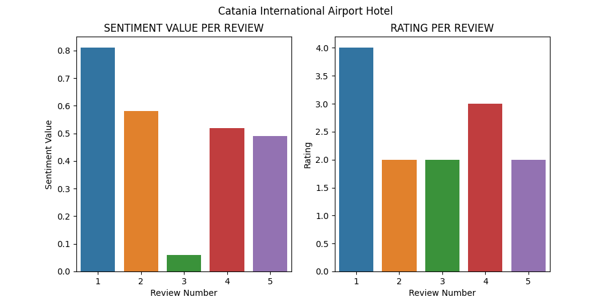
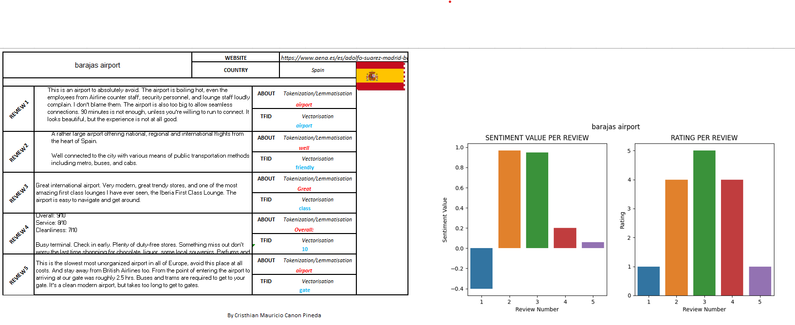

# GOOGLE REVIEW ANALYSIS

This reposity is a project that extract a review from google Maps through its API and using Natural Language Processing (NPL) and Python libraries provides an analysis of each review thorough graphs summarizing it in a excel sheet. 

## Overview
Once a place name is entered, it will call the API and process the sentiment analysis, tokenization, vectorization and its visualization of two graphs based on sentiment value and rating review per review using Python librarias as pandas, seaborn.
Finally, extracting that information to an excel sheet where the end user is able to check the information.

### Visualized graphs
The graphs mentioned allows users to evalute discrepancies or correspondeces between a textual review and the rating provided by the reviewer.
 

### Excel Sheet
Once a analysis review is completed, the relevant information is exported to an excel sheet where you may see relevant information of review such asgraphs, main website if available, and a flag representing where the place of the review is located.

